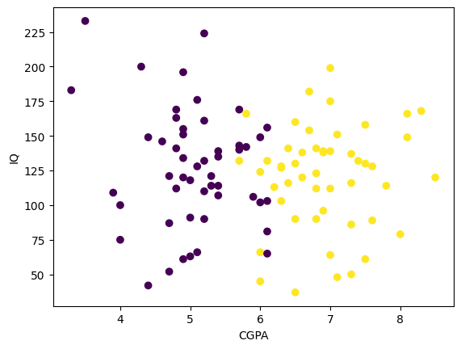

# Placement Prediction Model

This project aims to predict the placement status of students using various machine learning techniques. The dataset includes several features like academic scores, work experience, and employability test results.

## 🚀 Project Pipeline

0. **Preprocessing + EDA + Feature Selection**
1. **Extract Input and Output Columns**
2. **Scale the Feature Values**
3. **Train-Test Split**
4. **Train the Model**
5. **Evaluate the Model / Model Selection**
6. **Deploy the Model**

---
## 🌄 Images

### 📌 Scatter Plot of IQ and CGPA


### 🧠 Model Prediction Visualization

---

## 📊 Exploratory Data Analysis (EDA)

* Performed data cleaning and visualization
* Analyzed distributions and correlations
* Identified features that impact placement outcomes

## 🔍 Feature Engineering

* Removed irrelevant or redundant features
* Created new informative features when necessary
* Handled missing values

## ⚙️ Machine Learning Models

* Trained and tested multiple models including:

  * Logistic Regression
  * Random Forest
  * Support Vector Machine
  * XGBoost
* Evaluated performance using metrics such as accuracy, precision, recall

## 📈 Model Performance

* Tracked model scores and confusion matrices
* Selected the best-performing model based on real-world evaluation criteria

---

## 📁 File Structure

```
placement_model.ipynb       # Main Jupyter Notebook
placement.csv               # CSV file of the data
README.md                   # Project README
```

## 🧠 Requirements

* Python 3.8+
* pandas, numpy, matplotlib, seaborn
* scikit-learn, xgboost
* joblib or pickle (for saving model)

Install dependencies using:

```bash
pip install -r requirements.txt
```

## 🙌 Contributing

Feel free to fork the repository and submit pull requests to improve the model or add new features!

## 📬 Contact

For queries or collaborations, reach out via GitHub issues.

---

> *"Predicting tomorrow's placement decisions with today's data."*
